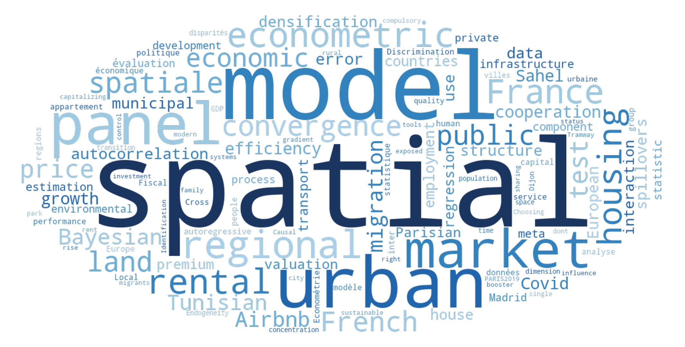

::: {.panel-tabset}

## By Type

:::: {.columns}

::: {.column width="30%"}
::: {.pub-toc}
**Contents**

[REFEREED ARTICLES](#refereed-articles-english)

&emsp;[In English](#refereed-articles-english)

&emsp;[In French](#refereed-articles-french)

[EDITORIALS](#editorials)

[BOOKS](#books)

[EDITED BOOKS](#edited-books)

[BOOK CHAPTERS](#book-chapters)
:::
:::

::: {.column width="5%"}
:::

::: {.column width="65%"}
{width="100%"}
:::

::::

### Refereed Articles (English)

- Le Gallo, J. (2026). [Urban economics for sustainable transitions: Grand challenges in urban structure, the urban-rural gradient and city systems](https://www.frontiersin.org/journals/sustainable-cities/articles/10.3389/frsc.2026.1835029/full). *Frontiers in Sustainable Cities*.
- Allam, Y., Breuillé, M., Le Gallo, J. (forthcoming). [From sharing to capitalizing: Assessing the rise of Airbnb in housing prices](https://onlinelibrary.wiley.com/doi/10.1111/jors.70051). *Journal of Regional Science*.
- Ben Youssef, F., Kriaa, M., Le Gallo, J. (forthcoming). [Impact of migration status on employment quality: Causal empirical evidence for Tunisian migrants](https://doi.org/10.1080/00036846.2025.2495888). *Applied Economics*.
- Galli, F., Le Gallo, J., Piedra-Peña, J.A., Breuillé, M. (2026). [Is compulsory inter-municipal cooperation an efficiency booster?](https://www.sciencedirect.com/science/article/pii/S0166046225001024) *Regional Science and Urban Economics*, 117, 104185.
- Dubé, J., Le Gallo, J., Hilal, M., Champagne, M.-P., Legros, D. (2026). [Can public investment in transport influence densification and land use? Evidence from the Tramway of Dijon (France)](https://www.sciencedirect.com/science/article/pii/S0967070X25004706). *Transport Policy*, 176, 103927.
- Ling, Y., Le Gallo, J. (2025). [Choosing right Bayesian tools: A comparative study of modern Bayesian methods in spatial econometric models](https://www.mdpi.com/2225-1146/13/4/49). *Econometrics*, 13(4), 49.
- Morin, Y., Le Gallo, J., Regnaud, M., Breuillé, M. (2025). [PARIS2019: The impact of rent control on the Parisian rental market](https://www.sciencedirect.com/science/article/pii/S1051137725000609). *Journal of Housing Economics*, 70, 102101.
- Dubé, J., Le Gallo, J., Hilal, M., Chapel, C., Des Rosiers, F. (2025). [Is there additional price premium for single-family houses exposed to urban park?](https://www.sciencedirect.com/science/article/pii/S0301479725033936) *Journal of Environmental Management*, 394, 127417.
- Debarsy, N., Le Gallo, J. (2025). [Identification of spatial spillovers: Do's and dont's](https://onlinelibrary.wiley.com/doi/10.1111/joes.12692). *Journal of Economic Surveys*, 39(5), 2152–2173.
- Yobom, O., Le Gallo, J. (2025). [Food security and weather events: a multidimensional analysis in the Sahel for the period 2000-2016](https://journals.sagepub.com/doi/10.1177/00219096231225949). *Journal of Asian and African Studies*, 60(5), 2972–2993.
- Ling, Y., Le Gallo, J., Breuillé, M. (2025). [From COVID-19 to 'new normal'? Revisiting of Parisian short-term rental markets and their dynamics](https://www.tandfonline.com/doi/full/10.1080/13683500.2024.2362378). *Current Issues in Tourism*, 28(13), 2173–2188.
- Agrawal, D., Le Gallo, J., Breuillé, M.-L. (2025). [Tax competition with intermunicipal cooperation](https://www.journals.uchicago.edu/doi/abs/10.1086/733246). *National Tax Journal*, 78(1), 5–43. **[Prix Musgrave]**
- Chapel, C., Le Gallo, J., Hilal, M. (2025). [Review and challenges in the economic valuation of green spaces](https://reunido.uniovi.es/index.php/EBL/article/view/21740). *Economics and Business Letters*, 14(1), 63–74.
- Flage, A., Le Gallo, J. (2025). [Discrimination against people with mental, physical or visual disabilities in the rental housing market](https://www.tandfonline.com/doi/full/10.1080/02673037.2023.2266412). *Housing Studies*, 40(1), 116–138.
- Piedra-Peña, J.A., Le Gallo, J., Breuillé, M. (2024). [Municipal efficiency spillovers in France](https://rdcu.be/d2IoO). *Annals of Regional Science*, 73, 2143–2172.
- Dubé, J., Le Gallo, J., Des Rosiers, F., Legros, D., Champagne, M.-P. (2024). [Evaluating house prime premium due to a new public transport infrastructure: Canadian evidence](https://www.sciencedirect.com/science/article/pii/S1366554524000917). *Transportation Research Part E*, 185, 103500.
- Ayouba, K., Le Gallo, J., Duboz, M.-L. (2023). [Assessing French Departments spending efficiency over time](https://www.tandfonline.com/eprint/EVMN4UGMQA9UXX7W3T2R/full). *Applied Economics*, 55(59), 6939–6964.
- Ling, Y., Le Gallo, J. (2023). [Bayesian spatial panel models: A flexible Kronecker error component approach](https://link.springer.com/article/10.1007/s12076-023-00362-8). *Letters in Spatial and Resource Sciences*, 16(39).
- Le Gallo, J., Sénégas, M.A. (2023). [On the proper computation of the Hausman test statistic in standard linear panel data models](https://www.mdpi.com/2225-1146/11/4/25). *Econometrics*, 11(4).
- Bellassen, V., Le Gallo, J., Legras, S., Saint-Cyr, L., Védrine, L. (2023). [Drivers of PES effectiveness: Some evidence from a quantitative meta-analysis](https://www.sciencedirect.com/science/article/pii/S0921800923001192). *Ecological Economics*, 210, 107856.
- Amba, M.C.O., Le Gallo, J., Mbratana, T. (2023). [Spatial panel simultaneous equations models with error components](https://link.springer.com/article/10.1007/s00181-023-02368-z). *Empirical Economics*, 65, 1149–1196.
- Le Gallo, J., Breuillé, M., Verlhiac, A. (2022). [Residential migration and the Covid-19 crisis: Towards an urban exodus in France?](https://www.insee.fr/en/statistiques/6667537) *Economie et Statistique*, 536-7, 57–73.
- Amba, M., Le Gallo, J. (2022). [Specification and estimation of a periodic spatial panel autoregressive model](https://link.springer.com/article/10.1007/s43071-022-00028-5). *Journal of Spatial Econometrics*, 3(1).
- Laajimi, R., Le Gallo, J. (2022). [Push and pull factors in Tunisian internal migration: the role of human capital](https://onlinelibrary.wiley.com/doi/10.1111/grow.12607). *Growth and Change*, 53(2), 771–799.
- Yobom, O., Le Gallo, J. (2022). [Climate and agriculture: empirical evidence for agroecological zones and countries of the Sahel](https://www.tandfonline.com/doi/full/10.1080/00036846.2021.1970710). *Applied Economics*, 54(8), 918–936.
- Martínez-Jiménez, E.T., Le Gallo, J., Pérez-Campuzano, E., Ibarra, A.A. (2022). [The valuation of environmental amenities at the peri-urban fringe in an informal land market](https://journals.sagepub.com/doi/10.1177/0042098020960968). *Urban Studies*, 59(1), 222–241.
- Ayouba, K., Le Gallo, J., Breuillé, M.-L., Grivault, C. (2021). [The spatial dimension of the French private rental markets](https://journals.sagepub.com/doi/full/10.1177/2399808320977877). *Environment and Planning B*, 48(8), 2497–2513.
- Tisserand, J.C., Le Gallo, J., Cochard, F., Georgantzis, N. (2021). [The fairness hypothesis across different populations: meta-analysis on the ultimatum and dictator games](https://www.sciencedirect.com/science/article/pii/S2214804320302895). *Journal of Behavioral and Experimental Economics*, 90, 101613.
- NDiaye, Y., Le Gallo, J. (2021). [Environmental expenditure interactions among OECD countries, 1995-2017](https://www.sciencedirect.com/science/article/pii/S0264999320312244). *Economic Modelling*, 94, 244–255.
- Laajimi, R., Le Gallo, J., Benammou, S. (2020). [What geographical concentration of industries in Tunisian Sahel?](https://onlinelibrary.wiley.com/doi/10.1111/tesg.12412) *Tijdschrift voor economische en sociale geografie*, 111(5), 738–757.
- Plunket, A., Le Gallo, J. (2020). [Regional gatekeepers, inventor networks and inventive performance](https://www.sciencedirect.com/science/article/pii/S0048733320300615). *Research Policy*, 49(5), 103981.
- Chasco, C., Le Gallo, J., Lopez, F. (2020). [Testing for spatial group-wise heteroskedasticity in spatial autocorrelation regression models](https://rdcu.be/bHFrt). *Annals of Regional Science*, 64(2), 287–312.
- Ayouba, K., Le Gallo, J., Breuillé, M.-L., Grivault, C. (2020). [Does Airbnb disrupt the private rental market? An empirical analysis for French cities](https://doi.org/10.1177/0160017618821428). *International Regional Science Review*, 43(1-2), 76–104.
- Ayouba, K., Le Gallo, J., Vallone, A. (2020). [Beyond GDP: an analysis of the socio-economic diversity of European regions](https://www.tandfonline.com/doi/full/10.1080/00036846.2019.1646885). *Applied Economics*, 52(9), 1010–1029.
- L'Horty, Y., Le Gallo, J., du Parquet, L., Petit, P. (2019). [Discrimination in access to housing: a test on urban areas in Metropolitan France](https://insee.fr/en/statistiques/4467360). *Economie et Statistique*, 513, 27–45.
- Georgantzis, N., Le Gallo, J., Peterle, E., Tisserand, J.-C. (2019). [Gender differences in legal disputes: the case of French labor courts](https://www.cairn.info/revue-economique-2019-6-page-1201.htm). *Revue Economique*, 70(6), 1201–1212.
- Duboz, M.-L., Le Gallo, J., Kroichvili, N. (2019). [Which attracts more FDI in services: national or regional performance?](https://link.springer.com/article/10.1007/s00168-019-00949-4) *Annals of Regional Science*, 63(3), 601–638.
- Ay, J.-S., Le Gallo, J., Hilal, M., Cavailhès, J. (2018). [Does issuing building permits reduce the cost of land?](https://www.persee.fr/doc/estat_0336-1454_2018_num_500_1_10834) *Economie et Statistique*, 500-501-502, 45–67.
- Kostov, P., Le Gallo, J. (2018). [What role for human capital in the growth process](http://dx.doi.org/10.1111/sjpe.12196). *Scottish Journal of Political Economy*, 65, 501–527.
- Fingleton, B., Le Gallo, J., Pirotte, A. (2018). [A multi-dimensional spatial lag panel data model with spatial moving average nested random effects errors](https://link.springer.com/article/10.1007/s00181-017-1410-7). *Empirical Economics*, 55, 113–146.
- Fingleton, B., Le Gallo, J., Pirotte, A. (2018). [Panel data models with spatially dependent nested random effects](http://onlinelibrary.wiley.com/doi/10.1111/jors.12327/full). *Journal of Regional Science*, 58(1), 63–80.
- Ayouba, K., Le Gallo, J., Ay, J.-S. (2018). [Nonlinear impact estimation in spatial autoregressive models](https://www.sciencedirect.com/science/article/pii/S0165176517304846). *Economics Letters*, 163, 59–64.
- Chasco, C., Le Gallo, J., Lopez, F. (2018). [A Scan test for spatial groupwise heteroscedasticity in cross-sectional models](https://www.sciencedirect.com/science/article/pii/S0166046216302927). *Regional Science and Urban Economics*, 68, 226–238.
- Balta-Ozkan, N., Le Gallo, J. (2018). [Spatial variation in energy attitudes and perceptions: evidence from Europe](http://www.sciencedirect.com/science/article/pii/S1364032117309620). *Renewable & Sustainable Energy Reviews*, 81, 2160–2180.
- Le Gallo, J., Breuillé, M.-L. (2017). [Spatial fiscal interactions among French municipalities within inter-municipal groups](http://www.tandfonline.com/doi/full/10.1080/00036846.2017.1287861). *Applied Economics*, 46, 4617–4637.
- Toumi, O., Le Gallo, J., Ben Rejeb, J. (2017). [Assessment of Latin American Sustainability](http://www.sciencedirect.com/science/article/pii/S1364032117306482). *Renewable & Sustainable Energy Reviews*, 78, 878–885.
- Ay, J.-S., Le Gallo, J., Chakir, R. (2017). [Aggregated versus individual land-use models: Modeling spatial autocorrelation to increase predictive accuracy](http://link.springer.com/article/10.1007/s10666-016-9523-5). *Environmental Modeling and Assessment*, 22, 129–145.
- L'Horty, Y., Le Gallo, J., Petit, P. (2017). [Does enhanced mobility of young people improve employment and housing outcomes?](http://www.sciencedirect.com/science/article/pii/S0094119016300547) *Journal of Urban Economics*, 97, 1–14.
- Duboz, M.-L., Le Gallo, J., Kroichvili, N. (2016). [Do foreign investors' location determinants in service functions differ according to sectors?](https://journals.sagepub.com/doi/10.1177/0160017615603196) *International Regional Science Review*, 39(4), 417–456.
- Cochard, F., Le Gallo, J., Franckx, L. (2015). [Regulation of pollution in the laboratory](http://onlinelibrary.wiley.com/doi/10.1111/boer.12035/abstract). *Bulletin of Economic Research*, 67(S1), S40–S73.
- Kostov, P., Le Gallo, J. (2015). [Convergence: a story of quantiles and spillovers](http://onlinelibrary.wiley.com/doi/10.1111/kykl.12093/abstract). *Kyklos*, 68(4), 552–576.
- Brisset, K., Le Gallo, J., Cochard, F. (2015). [Secret versus public reserve price in an 'outcry' English procurement auction](http://www.sciencedirect.com/science/article/pii/S0925527315002820). *International Journal of Production Economics*, 169, 285–298.
- Chasco, C., Le Gallo, J. (2015). [Heterogeneity in perceptions of noise and air pollution: a spatial quantile approach on the agglomeration of Madrid](http://www.tandfonline.com/doi/full/10.1080/17421772.2015.1062127). *Spatial Economic Analysis*, 10(3), 317–343.
- Le Gallo, J., López, F., Chasco, C. (2015). [Exploring Scan methods to test spatial structure with an application to housing prices in Madrid](http://onlinelibrary.wiley.com/doi/10.1111/pirs.12063/abstract). *Papers in Regional Science*, 94(2), 317–346.
- Le Gallo, J., Páez, A. (2013). [Using synthetic variables in instrumental variable estimation of spatial series models](http://journals.sagepub.com/doi/abs/10.1068/a45443). *Environment and Planning A*, 45(9), 2227–2242.
- Chakir, R., Le Gallo, J. (2013). [Predicting land use allocation in France: a spatial panel analysis](http://www.sciencedirect.com/science/article/pii/S0921800912001395). *Ecological Economics*, 92, 114–125.
- Chasco, C., Le Gallo, J. (2013). [The impact of objective and subjective measures of air quality and noise on house prices](http://onlinelibrary.wiley.com/doi/10.1111/j.1944-8287.2012.01172.x/abstract). *Economic Geography*, 89(2), 127–148.
- Guo, D., Le Gallo, J., Dall'erba, S. (2013). [The leading role of manufacturing in China's regional economic growth](https://journals.sagepub.com/doi/10.1177/0160017612457779). *International Regional Science Review*, 36(2), 139–166.
- Chasco, C., Le Gallo, J. (2012). [Hierarchy and spatial autocorrelation effects in hedonic models](https://ideas.repec.org/a/ebl/ecbull/eb-11-00777.html). *Economics Bulletin*, 32(2), 1474–1480.
- Gaigné, C., Le Gallo, J., Larue, S., Schmitt, B. (2012). [Does manure management regulation work against agglomeration economies?](https://doi.org/10.1093/ajae/aar121) *American Journal of Agricultural Economics*, 94(1), 116–132.
- Fingleton, B., Le Gallo, J. (2012). [Measurement errors in a spatial context](http://dx.doi.org/10.1016/j.regsciurbeco.2011.08.004). *Regional Science and Urban Economics*, 42(1-2), 114–125.
- Dall'erba, S., Le Gallo, J., Guillain, R. (2011). [The local vs. global dilemna of the effects of structural funds](http://onlinelibrary.wiley.com/doi/10.1111/j.1468-2257.2011.00564.x/abstract). *Growth and Change*, 42(4), 466–490.
- Duboz, M.-L., Le Gallo, J. (2011). Are EU-15 and CEEC agricultural exports in competition? *Economics Bulletin*, 31(1), 134–146.
- Kamarianakis, Y., Le Gallo, J. (2011). [The evolution of regional productivity disparities in the European Union from 1975 to 2002](http://www.tandfonline.com/doi/abs/10.1080/00343400903234662). *Regional Studies*, 45(1), 123–139.
- Guillain, R., Le Gallo, J. (2010). [Agglomeration and dispersion of economic activities in and around Paris](http://journals.sagepub.com/doi/abs/10.1068/b35038). *Environment and Planning B*, 37(6), 961–981.
- Dall'erba, S., Le Gallo, J., Guillain, R. (2009). Impact of structural funds on regional growth. *Région et Développement*, 30, 77–100.
- Bazen, S., Le Gallo, J. (2009). [The state-federal dichotomy in the effects of minimum wages on teenage employment in the United States](http://www.sciencedirect.com/science/article/pii/S016517650900278X). *Economics Letters*, 105(3), 267–269.
- Dall'erba, S., Le Gallo, J. (2008). [Spatial and sectoral productivity convergence between European regions, 1975-2000](http://onlinelibrary.wiley.com/doi/10.1111/j.1435-5957.2007.00159.x/abstract). *Papers in Regional Science*, 87(4), 505–525.
- Fingleton, B., Le Gallo, J. (2008). [Estimating spatial models with endogenous variables, a spatial lag and spatially dependent disturbances](http://onlinelibrary.wiley.com/doi/10.1111/j.1435-5957.2008.00187.x/abstract). *Papers in Regional Science*, 87(3), 319–339.
- Arbia, G., Le Gallo, J., Piras, G. (2008). [Does evidence on regional economic convergence depend on the estimation strategy?](http://www.tandfonline.com/doi/full/10.1080/17421770801996664) *Spatial Economic Analysis*, 3(2), 209–224.
- Dall'erba, S., Le Gallo, J. (2008). [Regional convergence and the impact of European structural funds over 1989-1999](http://onlinelibrary.wiley.com/doi/10.1111/j.1435-5957.2008.00184.x/abstract). *Papers in Regional Science*, 87(2), 219–244.
- Chasco, C., Le Gallo, J. (2008). [Spatial analysis of urban growth in Spain, 1900-2001](https://link.springer.com/article/10.1007/s00181-007-0150-5). *Empirical Economics*, 34(1), 59–80.
- Fingleton, B., Le Gallo, J. (2007). [Finite sample properties of estimators of spatial models with autoregressive, or moving average, disturbances](https://www.jstor.org/stable/27650041). *Annales d'Economie et de Statistique*, 87-88, 39–62.
- Ertur, C., Le Gallo, J., LeSage, J. (2007). [Local versus global convergence in Europe: a bayesian spatial econometric approach](https://rrs.scholasticahq.com/article/8289-local-versus-global-convergence-in-europe-a-bayesian-spatial-econometric-approach). *Review of Regional Studies*, 37(1), 82–108.
- Dall'erba, S., Le Gallo, J. (2007). [The impact of EU regional support on growth and employment](http://journal.fsv.cuni.cz/mag/article/show/id/1082). *Czech Journal of Economics and Finance*, 57(7-8), 325–340.
- Guillain, R., Le Gallo, J., Boiteux-Orain, C. (2006). [Changes in spatial and sectoral patterns of employment in Ile-de-France, 1978-1997](https://doi.org/10.1080/00420980600945203). *Urban Studies*, 43(11), 2075–2098.
- Anselin, L., Le Gallo, J. (2006). [Interpolation of air quality measures in hedonic house price models: spatial aspects](http://www.tandfonline.com/doi/full/10.1080/17421770600661337). *Spatial Economic Analysis*, 1(1), 31–52.
- Dall'erba, S., Le Gallo, J. (2006). [Evaluating the temporal and spatial heterogeneity of the European convergence process: 1980-1999](https://onlinelibrary.wiley.com/doi/abs/10.1111/j.0022-4146.2006.00441.x). *Journal of Regional Science*, 46(2), 269–288.
- Ertur, C., Le Gallo, J., Baumont, C. (2006). [The European regional convergence process, 1980-1995](https://journals.sagepub.com/doi/10.1177/0160017605279453). *International Regional Science Review*, 29(1), 2–34.
- Dall'erba, S., Le Gallo, J., Kamarianakis, Y., Plotnikova, M. (2005). Regional productivity differentials in three new member countries. *Review of Regional Studies*, 35(1), 97–116.
- Baumont, C., Le Gallo, J., Dall'erba, S., Ertur, C. (2005). [On the property of diffusion in the spatial error model](http://www.tandfonline.com/doi/abs/10.1080/13504850500120722). *Applied Economics Letters*, 12(9), 533–536.
- Baumont, C., Le Gallo, J., Ertur, C. (2004). [Spatial analysis of employment and population: the case of the agglomeration of Dijon, 1999](https://onlinelibrary.wiley.com/doi/10.1111/j.1538-4632.2004.tb01130.x). *Geographical Analysis*, 36(2), 146–176.
- Le Gallo, J. (2004). [Space-time analysis of GDP disparities among European regions: A Markov chains approach](https://journals.sagepub.com/doi/10.1177/0160017603262402). *International Regional Science Review*, 27(2), 138–163.
- Ertur, C., Le Gallo, J. (2003). [Exploratory spatial data analysis of the distribution of regional per capita GDP in Europe, 1980-1995](http://onlinelibrary.wiley.com/doi/10.1111/j.1435-5597.2003.tb00010.x/abstract). *Papers in Regional Science*, 82(2), 175–201.

<a href="#" title="Haut de page">⬆</a>

---

### Refereed Articles (French)

- Debarsy, N., Le Gallo, J. (2026). [Econométrie des données spatiales](https://regionetdeveloppement.univ-tln.fr/wp-content/uploads/14-Legallo.pdf). *Région et Développement*, 62-2025, 245–251.
- Ling, Y., Le Gallo, J., Allam, Y., Breuillé, M., Grivault, C. (2024). [Airbnb des villes et des champs à l'épreuve de la Covid-19](https://journals.openedition.org/rei/13033). *Revue d'Economie Industrielle*, 186, 9–88.
- Le Gallo, J., Breuillé, M.L., Bretagnolle, A. (2021). [Les bénéfices de la densification urbaine](https://www.cairn.info/revue-regards-croises-sur-l-economie-2021-1-page-170.htm). *Regards Croisés sur l'Economie*, 2021/1, 170–177.
- Challe, L., Le Gallo, J., L'Horty, Y., du Parquet, L., Petit, P. (2021). [Parent isolé recherche appartement: un test et une évaluation](https://doi.org/10.3917/popu.2101.0077). *Population*, 76(2021/1), 77–114.
- Duboz, M.-L., Le Gallo, J., Houser, M. (2021). [Aux origines des disparités de dépenses des départements français: une analyse empirique (2006-2016)](https://www.cairn.info/revue-d-economie-politique-2021-2-page-223.htm). *Revue d'Economie Politique*, 2021/2(132), 223–247.
- Anne, D., Le Gallo, J., L'Horty, Y. (2020). [Faciliter la mobilité quotidienne des jeunes éloignés de l'emploi: une évaluation expérimentale](https://www.cairn.info/revue-d-economie-politique-2020-4-page-519.htm). *Revue d'Economie Politique*, 130(4), 519–544.
- Ayouba, K., Le Gallo, J., Breuillé, M., Grivault, C., Nappi-Choulet, I. (2019). [Hétérogénéité spatiale des prix hédoniques des appartements du marché locatif privé en France](https://www.cairn.info/revue-francaise-d-economie-2019-2-page-203.htm). *Revue Française d'Economie*, XXXIV(3), 203–248.
- Le Gallo, J., Breuillé, M., Grivault, C., Le Goix, R. (2019). [Impact de la densification sur les coûts des infrastructures et services publics](https://www.cairn.info/revue-economique-2019-3-page-345.htm). *Revue Economique*, 70(3), 345–373.
- Duboz, M.-L., Le Gallo, J. (2014). L'apport de la politique de cohésion aux villes européennes. *Revue Française de Finances Publiques*, 125, pp. 57–68.
- Le Gallo, J., Mutl, J. (2014). [Autocorrélation spatiale et erreurs de mesure dans les modèles de régression spatiale](https://regionetdeveloppement.univ-tln.fr/wp-content/uploads/3_Le-Gallo-1.pdf). *Région et Développement*, 40-2014, 37–52.
- Duboz, M.-L., Le Gallo, J. (2013). Politique urbaine et cohésion. *Economie Appliquée*, LXVI(2), 133–160.
- Fingleton, B., Le Gallo, J. (2012). Endogénéité et modèle de Durbin. *Revue d'Economie Régionale et Urbaine*, 2012-01, 3–18.
- Duboz, M.-L., Le Gallo, J. (2011). Perspectives d'adhésion à l'UE et évolution des échanges agricoles des PECO. *Economie Rurale*, 325-326, 54–68.
- Dall'erba, S., Le Gallo, J., Guillain, R. (2009). Un regard nouveau sur les politiques de développement régional en Europe. *Canadian Journal of Regional Science*, 32(3), 465–480.
- Duboz, M.-L., Le Gallo, J., Guillain, R. (2009). Les schémas de concentration sectorielle au sein de l'Union Européenne. *Economie et Statistique*, 423, 59–76.
- Guillain, R., Le Gallo, J. (2008). [Fonds structurels, effets de débordement géographique et croissance régionale en Europe](https://www.cairn.info/revue-de-l-ofce-2008-1-p-241.htm). *Revue de l'OFCE*, 104, 241–270.
- Guillain, R., Le Gallo, J. (2008). Le centre d'affaire historique de Paris: quel pouvoir structurant sur l'espace économique en Ile-de-France? *Revue d'Economie Industrielle*, 123, 65–86.
- Guillain, R., Le Gallo, J. (2008). Identifier la localisation des activités économiques. *Economie Appliquée*, LXI(3), 5–34.
- Brossard, T., Le Gallo, J., Cavailhès, J. et al. (2007). La valeur économique des paysages des villes périurbanisées. *Economie Publique*, 20(1), 3–27.
- Baumont, C., Le Gallo, J., Ertur, C. (2006). [Clubs de convergence et effets de débordements géographiques](https://www.cairn.info/revue-economie-et-prevision-2006-2-page-111.htm). *Economie et Prévision*, 173(2), 111–134.
- Dall'erba, S., Le Gallo, J. (2005). Dynamique du processus de convergence régionale en Europe. *Région et Développement*, 2005-21, 119–139.
- Le Gallo, J. (2004). [La dynamique des disparités régionales dans l'Union Européenne, 1980-1995](https://www.cairn.info/revue-d-economie-regionale-et-urbaine-2004-4-page-491.html). *Revue d'Economie Régionale et Urbaine*, 4, 491–512.
- Le Gallo, J. (2004). Hétérogénéité spatiale, principes et méthodes. *Economie et Prévision*, 162(1), 151–172.
- Dall'erba, S., Le Gallo, J., Kamarianakis, Y., Plotnikova, M. (2003). Les différentiels de productivité régionale dans les pays en transition par rapport à la moyenne européenne. *Région et Développement*, 2003-18, 111–129.
- Le Gallo, J. (2002). Econométrie spatiale: l'autocorrélation spatiale dans les modèles de régression linéaire. *Economie et Prévision*, 155(4), 139–158.
- Baumont, C., Le Gallo, J., Ertur, C. (2002). [Estimations des effets de proximité dans le processus de convergence régionale](https://www.cairn.info/revue-d-economie-regionale-et-urbaine-2002-2-p-203.htm). *Revue d'Economie Régionale et Urbaine*, 2, 203–216.

<a href="#" title="Haut de page">⬆</a>

---

### Editorials

- Le Gallo, J. (2025). Introduction of Julie Le Gallo, Editor-in-Chief as of January 2025. *Journal of Geographical Systems*, 27, pp. 5–6.
- Le Gallo, J., Guillain, R. (2020). [Recent developments in spatial statistics and spatial econometrics](https://link.springer.com/article/10.1007/s00168-020-00983-7). *Annals of Regional Science*, 64(2), pp. 239–241.
- Le Gallo, J., Puech, F. (2019). [La structuration de l'espace économique](https://www.cairn.info/revue-economique-2019-3-page-301.htm). *Revue Economique*, 70(3), pp. 301–304.
- Le Gallo, J., Guillain, R. (2017). [Analyse économique de changements d'usage du sol](http://www.cairn.info/revue-economique-2017-3-p-405.htm). *Revue Economique*, 68, pp. 405–408.
- Le Gallo, J., Chasco, C. (2015). Spatial econometrics principles and challenges in Jean Paelinck's research. *Spatial Economic Analysis*, 10(3), pp. 263–269.
- Le Gallo, J., Thomas, I. (2015). [Statistique, économétrie et espace](https://www.cairn.info/revue-d-economie-regionale-et-urbaine-2015-1-page-9.htm). *Revue d'Economie Régionale et Urbaine*, 2015-1/2, pp. 9–23.
- Le Gallo, J., Florax, R.J.G.M., Bao, Y. (2014). [Introduction to special issue: Contributions to spatial econometrics](https://journals.sagepub.com/doi/10.1177/0160017614538818). *International Regional Science Review*, 37(3), pp. 247–250.
- Le Gallo, J., Páez, A. (2013). [Spatial econometrics: principles and challenges](https://www.tandfonline.com/doi/abs/10.1080/17421772.2013.849419). *Spatial Economic Analysis*.
- Le Gallo, J., Delgado, F.J. (2013). [Introduction to special issue on revisiting convergence](https://reunido.uniovi.es/index.php/EBL/article/view/10056). *Economics and Business Letters*, 2(4), pp. 140–142.
- Le Gallo, J., Guillain, R. (2009). [Introduction au numéro spécial: Croissance et gouvernance régionale](https://regionetdeveloppement.univ-tln.fr/wp-content/uploads/0-Introduction.pdf). *Région et Développement*, 2009-30, pp. 5–10.
- Le Gallo, J., Massard, N., Plunket, A. (2008). [Introduction au numéro spécial: Economie industrielle et économétrie spatiale](https://journals.openedition.org/rei/3882). *Revue d'Economie Industrielle*, 123, pp. 15–18.
- Le Gallo, J., Dall'erba, S. (2005). [Introduction au numéro spécial: Croissance, convergence et interactions spatiales](https://regionetdeveloppement.univ-tln.fr/wp-content/uploads/R21_intro.pdf). *Région et Développement*, 2005-21, pp. 5–11.

<a href="#" title="Haut de page">⬆</a>

---

### Books

- Le Gallo, J., Dubé, J., Devaux, N., Legros, D. (2024). [*Introduction à l'analyse des politiques publiques d'aménagement. Une approche pratique*](https://www.deboecksuperieur.com/ouvrage/9782807363502-introduction-l-analyse-des-politiques-publiques-d-amenagement). De Boeck.

<a href="#" title="Haut de page">⬆</a>

### Edited Books

- Arbia, G., Baltagi, B. (Eds.), Le Gallo, J. (contributor). (2009). [*Progress in Spatial Analysis: Theory and Computation, and Thematic Applications*](http://www.springer.com/economics/regional+science/book/978-3-642-03324-7). Springer.

<a href="#" title="Haut de page">⬆</a>

---

### Book Chapters

- Le Gallo, J., Breuillé, M.-L. (2025). Local public cooperation. In [*Thematic Encyclopedia of Regional Science*](https://www.e-elgar.com/shop/gbp/thematic-encyclopedia-of-regional-science-9781800379275.html). Edward Elgar.
- Le Gallo, J., Breuillé, M.-L. (2025). Fiscal equalization. In [*Thematic Encyclopedia of Regional Science*](https://www.e-elgar.com/shop/gbp/thematic-encyclopedia-of-regional-science-9781800379275.html). Edward Elgar.
- Chasco, C., Le Gallo, J., Lopez, F. (2024). The spatial structure of housing process in Madrid. In [*Handbook of Scan Statistics*](https://link.springer.com/referenceworkentry/10.1007/978-1-4614-8033-4_58). Springer.
- Le Gallo, J., Hilal, M. (2023). Carte et modèle statistique pour explorer l'hétérogénéité spatiale. In [*Traitements et cartographie pour l'information géographique*](https://www.istegroup.com/fr/produit/traitements-et-cartographie-de-linformation-geographique/). ISTE.
- Le Gallo, J., Védrine, L. (2021). Does cohesion policy affect regional development. In [*EU Cohesion Policy and Spatial Governance*](https://www.e-elgar.com/shop/gbp/eu-cohesion-policy-and-spatial-governance-9781839103575.html). Edward Elgar.
- Le Gallo, J., Chakir, R. (2021). Spatial autocorrelation in econometric land use models. In [*Advances in Contemporary Statistics and Econometrics*](https://link.springer.com/book/10.1007/978-3-030-73249-3). Springer.
- Le Gallo, J., Fingleton, B. (2021). Endogeneity in spatial models. In [*Handbook of Regional Science*](https://link.springer.com/referenceworkentry/10.1007/978-3-642-36203-3_122-1). Springer.
- Le Gallo, J., Fingleton, B. (2021). Cross-section spatial regression models. In [*Handbook of Regional Science*](https://link.springer.com/referenceworkentry/10.1007/978-3-642-36203-3_85-1). Springer.
- Le Gallo, J., Fingleton, B. (2021). Regional growth and convergence empirics. In [*Handbook of Regional Science*](https://link.springer.com/referenceworkentry/10.1007/978-3-642-36203-3_17-1). Springer.
- Le Gallo, J., Breuillé, M.-L. (2019). Les effets de la densité sur les coûts des infrastructures. In [*Le Grand Paris Express : les enjeux économiques et urbains*](https://www.economica.fr/livre-le-grand-paris-express-les-enjeux-economiques-et-urbains-prager-jean-claude-sld). Economica.
- Le Gallo, J., Ertur, C. (2019). Heterogeneous reaction versus interaction in spatial econometric regional growth. In [*Handbook of Regional Growth and Development Theories*](https://www.elgaronline.com/view/edcoll/9781788970013/9781788970013.xml). Edward Elgar.
- Le Gallo, J., Bouayad Agha, S., Védrine, L. (2018). Econométrie spatiale sur données de panel. In [*Manuel d'Analyse Spatiale*](https://www.insee.fr/fr/information/3635442). INSEE.
- Le Gallo, J., Pirotte, A. (2017). Models for spatial panels. In [*The Econometrics of Multi-dimensional Panels*](http://www.springer.com/in/book/9783319607825). Springer.
- Le Gallo, J. (2014). [Cross-section spatial regression models](https://link.springer.com/referenceworkentry/10.1007/978-3-642-23430-9_85). In *Handbook of Regional Science* (1st ed.). Springer, pp. 1511–1533.
- Le Gallo, J., Fingleton, B. (2014). [Regional growth and convergence empirics](https://link.springer.com/referenceworkentry/10.1007/978-3-642-23430-9_17). In *Handbook of Regional Science* (1st ed.). Springer, pp. 291–315.
- Le Gallo, J., Chasco, C. (2012). Dealing with data at various spatial scales and supports. In [*Defining the Spatial Scale in Modern Regional Analysis*](http://www.springer.com/economics/regional+science/book/978-3-642-31993-8). Springer, pp. 281–310.
- Le Gallo, J., Fingleton, B. (2009). Endogeneity in a spatial context. In [*Progress in Spatial Analysis*](http://www.springer.com/economics/regional+science/book/978-3-642-03324-7). Springer, pp. 59–73.
- Le Gallo, J., Guillain, R. (2009). Employment density in Ile-de-France: evidence from local regressions. In [*Progress in Spatial Analysis*](http://www.springer.com/economics/regional+science/book/978-3-642-03324-7). Springer, pp. 233–251.
- Le Gallo, J., Rey, S.J. (2009). [Spatial analysis of economic convergence](https://link.springer.com/chapter/10.1057/9780230244405_27). In *The Palgrave Handbook of Econometrics Volume II: Applied Econometrics*. Palgrave-MacMillan, pp. 1251–1292.
- Le Gallo, J., Ertur, C. (2009). Regional growth and convergence: heterogeneous reaction versus interaction in spatial econometric approaches. In *Handbook of Regional Growth and Development Theories*. Edward Elgar, pp. 374–388.
- Le Gallo, J., Gaschet, F. (2009). [La dimension spatiale de la ségrégation](https://www.lcdpu.fr/livre/?GCOI=27000100505210&fa=sommaire). In *Métropolisation et ségrégation*. Presses Universitaires de Bordeaux, pp. 45–65.
- Le Gallo, J., Chasco, C. (2008). [Spatial analysis of urban growth in Spain, 1900-2001](https://link.springer.com/chapter/10.1007/978-3-7908-2070-6_4). In *Spatial Econometrics: Methods and Applications*. Physica-Verlag/Springer, pp. 59–80.
- Le Gallo, J., Anselin, L., Jayet, H. (2008). [Spatial econometrics and panel data models](https://link.springer.com/chapter/10.1007/978-3-540-75892-1_19). In *The Econometrics of Panel Data* (3rd ed.). Kluwer Academic Publishers, pp. 625–660.
- Le Gallo, J., Guillain, R. (2006). [La localisation des activités économiques en Ile-de-France](https://eud.ube.fr/economie-gestion-politique/143-paris-et-ses-franges-etalement-urbain-et-polycentrisme-2915552541.html). In *Paris et ses franges : étalement urbain et polycentrisme*. Editions Universitaires de Dijon, pp. 203–230.
- Le Gallo, J., Dall'erba, S. (2006). [Convergence spatiale et sectorielle de la productivité du travail en Europe](https://shs.cairn.info/politique-regionale-europeen--9782804149963-page-107?lang=fr). In *Convergence et dynamique d'innovation au sein de l'Espace Européen*. Editions De Boeck, pp. 107–133.
- Le Gallo, J., Ertur, C. (2003). [An exploratory spatial data analysis of European regional disparities, 1980-1995](https://link.springer.com/chapter/10.1007/978-3-662-07136-6_3). In *European Regional Growth*. Springer, pp. 55–98.
- Le Gallo, J., Ertur, C., Baumont, C. (2003). [A spatial econometric analysis of convergence across European regions, 1980-1995](https://link.springer.com/chapter/10.1007/978-3-662-07136-6_4). In *European Regional Growth*. Springer, pp. 99–130.
- Le Gallo, J., Baumont, C., Ertur, C. (2003). [Spatial Convergence Clubs and the European Regional Growth Process, 1980-1995](https://link.springer.com/chapter/10.1007/978-3-662-07136-6_5). In *European Regional Growth*. Springer, pp. 131–158.
- Le Gallo, J., Baumont, C. (2000). Les nouvelles centralités urbaines. In *Economie géographique : les théories à l'épreuve des faits*. Economica, pp. 211–239.

<a href="#" title="Haut de page">⬆</a>

---

## By Theme

::: {.pub-toc}
**Contents**

[Spatial data statistics and econometrics](#spatial-data-statistics-and-econometrics)

[Location choices, spatial distribution of economic activities](#location-choices-and-spatial-distribution-of-economic-activities)

[Land use, land and housing economics, housing policies](#land-use-land-and-housing-economics)

[Local public economics](#local-public-economics)

[Agricultural and environmental economics & policies](#agricultural-and-environmental-economics-policies)

[Regional disparities, convergence and cohesion policies](#regional-disparities-convergence-and-cohesion-policies)

[Other](#other-topics)
:::

### 1. Spatial Data Statistics and Econometrics

- Debarsy, N., Le Gallo, J. (2026). [Econométrie des données spatiales](https://regionetdeveloppement.univ-tln.fr/wp-content/uploads/14-Legallo.pdf). *Région et Développement*, 62-2025.
- Ling, Y., Le Gallo, J. (2025). [Choosing right Bayesian tools: A comparative study of modern Bayesian methods in spatial econometric models](https://www.mdpi.com/2225-1146/13/4/49). *Econometrics*, 13(4), 49.
- Debarsy, N., Le Gallo, J. (2025). [Identification of spatial spillovers: Do's and dont's](https://onlinelibrary.wiley.com/doi/10.1111/joes.12692). *Journal of Economic Surveys*, 39(5), 2152–2173.
- Ling, Y., Le Gallo, J. (2023). [Bayesian spatial panel models: A flexible Kronecker error component approach](https://link.springer.com/article/10.1007/s12076-023-00362-8). *Letters in Spatial and Resource Sciences*, 16(39).
- Le Gallo, J., Hilal, M. (2023). [Carte et modèle statistique pour explorer l'hétérogénéité spatiale](https://www.istegroup.com/fr/produit/traitements-et-cartographie-de-linformation-geographique/). In *Traitements et cartographie pour l'information géographique*. ISTE.
- Amba, M.C.O., Le Gallo, J., Mbratana, T. (2023). [Spatial panel simultaneous equations models with error components](https://link.springer.com/article/10.1007/s00181-023-02368-z). *Empirical Economics*, 65, 1149–1196.
- Amba, M., Le Gallo, J. (2022). [Specification and estimation of a periodic spatial panel autoregressive model](https://link.springer.com/article/10.1007/s43071-022-00028-5). *Journal of Spatial Econometrics*, 3(1).
- Le Gallo, J., Fingleton, B. (2021). [Endogeneity in spatial models](https://link.springer.com/referenceworkentry/10.1007/978-3-642-36203-3_122-1). In *Handbook of Regional Science* (2nd ed.). Springer.
- Le Gallo, J., Fingleton, B. (2021). [Cross-section spatial regression models](https://link.springer.com/referenceworkentry/10.1007/978-3-642-36203-3_85-1). In *Handbook of Regional Science* (2nd ed.). Springer.
- Le Gallo, J., Guillain, R. (2020). [Recent developments in spatial statistics and spatial econometrics](https://link.springer.com/article/10.1007/s00168-020-00983-7). *Annals of Regional Science*, 64(2), pp. 239–241.
- Chasco, C., Le Gallo, J., Lopez, F. (2020). [Testing for spatial group-wise heteroskedasticity in spatial autocorrelation regression models](https://rdcu.be/bHFrt). *Annals of Regional Science*, 64(2), 287–312.
- Fingleton, B., Le Gallo, J., Pirotte, A. (2018). [A multi-dimensional spatial lag panel data model with spatial moving average nested random effects errors](https://link.springer.com/article/10.1007/s00181-017-1410-7). *Empirical Economics*, 55, 113–146.
- Fingleton, B., Le Gallo, J., Pirotte, A. (2018). [Panel data models with spatially dependent nested random effects](http://onlinelibrary.wiley.com/doi/10.1111/jors.12327/full). *Journal of Regional Science*, 58(1), 63–80.
- Ayouba, K., Le Gallo, J., Ay, J.-S. (2018). [Nonlinear impact estimation in spatial autoregressive models](https://www.sciencedirect.com/science/article/pii/S0165176517304846). *Economics Letters*, 163, 59–64.
- Chasco, C., Le Gallo, J., Lopez, F. (2018). [A Scan test for spatial groupwise heteroscedasticity in cross-sectional models](https://www.sciencedirect.com/science/article/pii/S0166046216302927). *Regional Science and Urban Economics*, 68, 226–238.
- Le Gallo, J., Bouayad Agha, S., Védrine, L. (2018). [Econométrie spatiale sur données de panel](https://www.insee.fr/fr/information/3635442). In *Manuel d'Analyse Spatiale*. INSEE.
- Le Gallo, J., Pirotte, A. (2017). [Models for spatial panels](http://www.springer.com/in/book/9783319607825). In *The Econometrics of Multi-dimensional Panels*. Springer.
- Le Gallo, J., López, F., Chasco, C. (2015). [Exploring Scan methods to test spatial structure with an application to housing prices in Madrid](http://onlinelibrary.wiley.com/doi/10.1111/pirs.12063/abstract). *Papers in Regional Science*, 94(2), 317–346.
- Le Gallo, J., Chasco, C. (2015). Spatial econometrics principles and challenges in Jean Paelinck's research. *Spatial Economic Analysis*, 10(3), pp. 263–269.
- Le Gallo, J., Páez, A. (2013). [Spatial econometrics: principles and challenges](https://www.tandfonline.com/doi/abs/10.1080/17421772.2013.849419). *Spatial Economic Analysis*.
- Le Gallo, J., Thomas, I. (2015). [Statistique, économétrie et espace](https://www.cairn.info/revue-d-economie-regionale-et-urbaine-2015-1-page-9.htm). *Revue d'Economie Régionale et Urbaine*, 2015-1/2, pp. 9–23.
- Le Gallo, J., Mutl, J. (2014). [Autocorrélation spatiale et erreurs de mesure dans les modèles de régression spatiale](https://regionetdeveloppement.univ-tln.fr/wp-content/uploads/3_Le-Gallo-1.pdf). *Région et Développement*, 40-2014.
- Le Gallo, J., Páez, A. (2013). [Using synthetic variables in instrumental variable estimation of spatial series models](http://journals.sagepub.com/doi/abs/10.1068/a45443). *Environment and Planning A*, 45(9), 2227–2242.
- Fingleton, B., Le Gallo, J. (2012). [Measurement errors in a spatial context](http://dx.doi.org/10.1016/j.regsciurbeco.2011.08.004). *Regional Science and Urban Economics*, 42(1-2), 114–125.
- Fingleton, B., Le Gallo, J. (2012). Endogénéité et modèle de Durbin. *Revue d'Economie Régionale et Urbaine*.
- Arbia, G., Le Gallo, J., Páez, A., Dall'erba, S., Buliung, R. (Eds.) (2009). [*Progress in Spatial Analysis*](http://www.springer.com/economics/regional+science/book/978-3-642-03324-7). Springer.
- Fingleton, B., Le Gallo, J. (2008). [Estimating spatial models with endogenous variables, a spatial lag and spatially dependent disturbances](http://onlinelibrary.wiley.com/doi/10.1111/j.1435-5957.2008.00187.x/abstract). *Papers in Regional Science*, 87(3), 319–339.
- Fingleton, B., Le Gallo, J. (2007). [Finite sample properties of estimators of spatial models with autoregressive, or moving average, disturbances](https://www.jstor.org/stable/27650041). *Annales d'Economie et de Statistique*, 87-88, 39–62.
- Baumont, C., Le Gallo, J., Dall'erba, S., Ertur, C. (2005). [On the property of diffusion in the spatial error model](http://www.tandfonline.com/doi/abs/10.1080/13504850500120722). *Applied Economics Letters*, 12(9), 533–536.
- Le Gallo, J. (2004). [Hétérogénéité spatiale, principes et méthodes](https://www.cairn.info/revue-economie-et-prevision-2004-1-page-151.htm). *Economie et Prévision*, 162(1), 151–172.
- Le Gallo, J. (2014). [Cross-section spatial regression models](https://link.springer.com/referenceworkentry/10.1007/978-3-642-23430-9_85). In *Handbook of Regional Science* (1st ed.). Springer, pp. 1511–1533.
- Le Gallo, J., Anselin, L., Jayet, H. (2008). [Spatial econometrics and panel data models](https://link.springer.com/chapter/10.1007/978-3-540-75892-1_19). In *The Econometrics of Panel Data* (3rd ed.). Kluwer Academic Publishers, pp. 625–660.
- Le Gallo, J. (2002). Econométrie spatiale: l'autocorrélation spatiale dans les modèles de régression linéaire. *Economie et Prévision*, 155(4), 139–158.

<a href="#" title="Haut de page">⬆</a>

---

### 2. Location Choices and Spatial Distribution of Economic Activities

- Le Gallo, J. (2026). [Urban economics for sustainable transitions: Grand challenges in urban structure, the urban-rural gradient and city systems](https://www.frontiersin.org/journals/sustainable-cities/articles/10.3389/frsc.2026.1835029/full). *Frontiers in Sustainable Cities*.
- Dubé, J., Le Gallo, J., Hilal, M., Champagne, M.-P., Legros, D. (2026). [Can public investment in transport influence densification and land use? Evidence from the Tramway of Dijon (France)](https://www.sciencedirect.com/science/article/pii/S0967070X25004706). *Transport Policy*, 176, 103927.
- Ben Youssef, F., Kriaa, M., Le Gallo, J. (forthcoming). [Impact of migration status on employment quality: Causal empirical evidence for Tunisian migrants](https://doi.org/10.1080/00036846.2025.2495888). *Applied Economics*.
- Ling, Y., Le Gallo, J., Breuillé, M. (2025). [From COVID-19 to 'new normal'? Revisiting of Parisian short-term rental markets and their dynamics](https://www.tandfonline.com/doi/full/10.1080/13683500.2024.2362378). *Current Issues in Tourism*, 28(13), 2173–2188.
- Ling, Y., Le Gallo, J., Allam, Y., Breuillé, M., Grivault, C. (2024). [Airbnb des villes et des champs à l'épreuve de la Covid-19](https://journals.openedition.org/rei/13033). *Revue d'Economie Industrielle*, 186, 9–88.
- Le Gallo, J., Breuillé, M., Verlhiac, A. (2022). [Residential migration and the Covid-19 crisis: Towards an urban exodus in France?](https://www.insee.fr/en/statistiques/6667537) *Economie et Statistique*, 536-7, 57–73.
- Laajimi, R., Le Gallo, J. (2022). [Push and pull factors in Tunisian internal migration: the role of human capital](https://onlinelibrary.wiley.com/doi/10.1111/grow.12607). *Growth and Change*, 53(2), 771–799.
- Laajimi, R., Le Gallo, J., Benammou, S. (2020). [What geographical concentration of industries in Tunisian Sahel?](https://onlinelibrary.wiley.com/doi/10.1111/tesg.12412) *Tijdschrift voor economische en sociale geografie*, 111(5), 738–757.
- Anne, D., Le Gallo, J., L'Horty, Y. (2020). [Faciliter la mobilité quotidienne des jeunes éloignés de l'emploi: une évaluation expérimentale](https://www.cairn.info/revue-d-economie-politique-2020-4-page-519.htm). *Revue d'Economie Politique*, 130(4), 519–544.
- Duboz, M.-L., Le Gallo, J., Kroichvili, N. (2019). [Which attracts more FDI in services: national or regional performance?](https://link.springer.com/article/10.1007/s00168-019-00949-4) *Annals of Regional Science*, 63(3), 601–638.
- Le Gallo, J., Puech, F. (2019). [La structuration de l'espace économique](https://www.cairn.info/revue-economique-2019-3-page-301.htm). *Revue Economique* (editorial), 70(3), pp. 301–304.
- L'Horty, Y., Le Gallo, J., Petit, P. (2017). [Does enhanced mobility of young people improve employment and housing outcomes?](http://www.sciencedirect.com/science/article/pii/S0094119016300547) *Journal of Urban Economics*, 97, 1–14.
- Duboz, M.-L., Le Gallo, J., Kroichvili, N. (2016). [Do foreign investors' location determinants in service functions differ according to sectors?](https://journals.sagepub.com/doi/10.1177/0160017615603196) *International Regional Science Review*, 39(4), 417–456.
- Guillain, R., Le Gallo, J. (2010). [Agglomeration and dispersion of economic activities in and around Paris](http://journals.sagepub.com/doi/abs/10.1068/b35038). *Environment and Planning B*, 37(6), 961–981.
- Guillain, R., Le Gallo, J., Boiteux-Orain, C. (2006). [Changes in spatial and sectoral patterns of employment in Ile-de-France, 1978-1997](https://doi.org/10.1080/00420980600945203). *Urban Studies*, 43(11), 2075–2098.
- Chasco, C., Le Gallo, J. (2008). [Spatial analysis of urban growth in Spain, 1900-2001](https://link.springer.com/article/10.1007/s00181-007-0150-5). *Empirical Economics*, 34(1), 59–80.
- Baumont, C., Le Gallo, J., Ertur, C. (2004). [Spatial analysis of employment and population: the case of the agglomeration of Dijon, 1999](https://onlinelibrary.wiley.com/doi/10.1111/j.1538-4632.2004.tb01130.x). *Geographical Analysis*, 36(2), 146–176.
- Le Gallo, J., Guillain, R. (2009). Employment density in Ile-de-France: evidence from local regressions. In *Progress in Spatial Analysis*. Springer, pp. 233–251.
- Le Gallo, J., Gaschet, F. (2009). [La dimension spatiale de la ségrégation](https://www.lcdpu.fr/livre/?GCOI=27000100505210&fa=sommaire). In *Métropolisation et ségrégation*. Presses Universitaires de Bordeaux, pp. 45–65.
- Le Gallo, J., Chasco, C. (2008). [Spatial analysis of urban growth in Spain, 1900-2001](https://link.springer.com/chapter/10.1007/978-3-7908-2070-6_4). In *Spatial Econometrics: Methods and Applications*. Physica-Verlag/Springer, pp. 59–80.
- Le Gallo, J., Guillain, R. (2006). [La localisation des activités économiques en Ile-de-France](https://eud.ube.fr/economie-gestion-politique/143-paris-et-ses-franges-etalement-urbain-et-polycentrisme-2915552541.html). In *Paris et ses franges : étalement urbain et polycentrisme*. Editions Universitaires de Dijon, pp. 203–230.
- Le Gallo, J., Baumont, C. (2000). Les nouvelles centralités urbaines. In *Economie géographique : les théories à l'épreuve des faits*. Economica, pp. 211–239.

<a href="#" title="Haut de page">⬆</a>

---

### 3. Land Use, Land and Housing Economics

- Allam, Y., Breuillé, M., Le Gallo, J. (forthcoming). [From sharing to capitalizing: Assessing the rise of Airbnb in housing prices](https://onlinelibrary.wiley.com/doi/10.1111/jors.70051). *Journal of Regional Science*.
- Dubé, J., Le Gallo, J., Hilal, M., Chapel, C., Des Rosiers, F. (2025). [Is there additional price premium for single-family houses exposed to urban park?](https://www.sciencedirect.com/science/article/pii/S0301479725033936) *Journal of Environmental Management*, 394, 127417.
- Morin, Y., Le Gallo, J., Regnaud, M., Breuillé, M. (2025). [PARIS2019: The impact of rent control on the Parisian rental market](https://www.sciencedirect.com/science/article/pii/S1051137725000609). *Journal of Housing Economics*, 70, 102101.
- Chasco, C., Le Gallo, J., Lopez, F. (2024). [The spatial structure of housing process in Madrid](https://link.springer.com/referenceworkentry/10.1007/978-1-4614-8033-4_58). In *Handbook of Scan Statistics*. Springer.
- Dubé, J., Le Gallo, J., Des Rosiers, F., Legros, D., Champagne, M.-P. (2024). [Evaluating house prime premium due to a new public transport infrastructure: Canadian evidence](https://www.sciencedirect.com/science/article/pii/S1366554524000917). *Transportation Research Part E*, 185, 103500.
- Flage, A., Le Gallo, J. (2025). [Discrimination against people with mental, physical or visual disabilities in the rental housing market](https://www.tandfonline.com/doi/full/10.1080/02673037.2023.2266412). *Housing Studies*, 40(1), 116–138.
- Martínez-Jiménez, E.T., Le Gallo, J., et al. (2022). [The valuation of environmental amenities at the peri-urban fringe in an informal land market](https://journals.sagepub.com/doi/10.1177/0042098020960968). *Urban Studies*, 59(1), 222–241.
- Le Gallo, J., Chakir, R. (2021). [Spatial autocorrelation in econometric land use models](https://link.springer.com/book/10.1007/978-3-030-73249-3). In *Advances in Contemporary Statistics and Econometrics*. Springer.
- Ayouba, K., Le Gallo, J., Breuillé, M.-L., Grivault, C. (2021). [The spatial dimension of the French private rental markets](https://journals.sagepub.com/doi/full/10.1177/2399808320977877). *Environment and Planning B*, 48(8), 2497–2513.
- Challe, L., Le Gallo, J., L'Horty, Y., et al. (2021). [Parent isolé recherche appartement: un test et une évaluation](https://doi.org/10.3917/popu.2101.0077). *Population*, 76(2021/1), 77–114.
- Ayouba, K., Le Gallo, J., Breuillé, M.-L., Grivault, C. (2020). [Does Airbnb disrupt the private rental market? An empirical analysis for French cities](https://doi.org/10.1177/0160017618821428). *International Regional Science Review*, 43(1-2), 76–104.
- L'Horty, Y., Le Gallo, J., du Parquet, L., Petit, P. (2019). [Discrimination in access to housing: a test on urban areas in Metropolitan France](https://insee.fr/en/statistiques/4467360). *Economie et Statistique*, 513, 27–45.
- Ayouba, K., Le Gallo, J., et al. (2019). [Hétérogénéité spatiale des prix hédoniques des appartements du marché locatif privé en France](https://www.cairn.info/revue-francaise-d-economie-2019-2-page-203.htm). *Revue Française d'Economie*, XXXIV(3), 203–248.
- Ay, J.-S., Le Gallo, J., Hilal, M., Cavailhès, J. (2018). [Does issuing building permits reduce the cost of land?](https://www.persee.fr/doc/estat_0336-1454_2018_num_500_1_10834) *Economie et Statistique*, 500-501-502, 45–67.
- Ay, J.-S., Le Gallo, J., Chakir, R. (2017). [Aggregated versus individual land-use models: Modeling spatial autocorrelation to increase predictive accuracy](http://link.springer.com/article/10.1007/s10666-016-9523-5). *Environmental Modeling and Assessment*, 22, 129–145.
- Le Gallo, J. (2017). [Analyse économique de changements d'usage du sol](http://www.cairn.info/revue-economique-2017-3-p-405.htm). *Revue Economique* (editorial).
- Chasco, C., Le Gallo, J. (2015). [Heterogeneity in perceptions of noise and air pollution: a spatial quantile approach on the agglomeration of Madrid](http://www.tandfonline.com/doi/full/10.1080/17421772.2015.1062127). *Spatial Economic Analysis*, 10(3), 317–343.
- Chakir, R., Le Gallo, J. (2013). [Predicting land use allocation in France: a spatial panel analysis](http://www.sciencedirect.com/science/article/pii/S0921800912001395). *Ecological Economics*, 92, 114–125.
- Chasco, C., Le Gallo, J. (2013). [The impact of objective and subjective measures of air quality and noise on house prices](http://onlinelibrary.wiley.com/doi/10.1111/j.1944-8287.2012.01172.x/abstract). *Economic Geography*, 89(2), 127–148.
- Chasco, C., Le Gallo, J. (2012). [Hierarchy and spatial autocorrelation effects in hedonic models](https://ideas.repec.org/a/ebl/ecbull/eb-11-00777.html). *Economics Bulletin*, 32(2), 1474–1480.
- Le Gallo, J., Chasco, C. (2012). [Dealing with data at various spatial scales and supports](http://www.springer.com/economics/regional+science/book/978-3-642-31993-8). In *Defining the Spatial Scale in Modern Regional Analysis*. Springer, pp. 281–310.
- Brossard, T., Le Gallo, J., Cavailhès, J. et al. (2007). La valeur économique des paysages des villes périurbanisées. *Economie Publique*, 20(1), 3–27.
- Anselin, L., Le Gallo, J. (2006). [Interpolation of air quality measures in hedonic house price models: spatial aspects](http://www.tandfonline.com/doi/full/10.1080/17421770600661337). *Spatial Economic Analysis*, 1(1), 31–52.

<a href="#" title="Haut de page">⬆</a>

---

### 4. Local Public Economics

- Galli, F., Le Gallo, J., Piedra-Peña, J.A., Breuillé, M. (2026). [Is compulsory inter-municipal cooperation an efficiency booster?](https://www.sciencedirect.com/science/article/pii/S0166046225001024) *Regional Science and Urban Economics*, 117, 104185.
- Agrawal, D., Le Gallo, J., Breuillé, M.-L. (2025). [Tax competition with intermunicipal cooperation](https://www.journals.uchicago.edu/doi/abs/10.1086/733246). *National Tax Journal*, 78(1), 5–43. **[Prix Musgrave]**
- Le Gallo, J., Breuillé, M.-L. (2025). [Local public cooperation](https://www.e-elgar.com/shop/gbp/thematic-encyclopedia-of-regional-science-9781800379275.html). In *Thematic Encyclopedia of Regional Science*. Edward Elgar.
- Le Gallo, J., Breuillé, M.-L. (2025). [Fiscal equalization](https://www.e-elgar.com/shop/gbp/thematic-encyclopedia-of-regional-science-9781800379275.html). In *Thematic Encyclopedia of Regional Science*. Edward Elgar.
- Piedra-Peña, J.A., Le Gallo, J., Breuillé, M. (2024). [Municipal efficiency spillovers in France](https://rdcu.be/d2IoO). *Annals of Regional Science*, 73, 2143–2172.
- Ayouba, K., Le Gallo, J., Duboz, M.-L. (2023). [Assessing French Departments spending efficiency over time](https://www.tandfonline.com/eprint/EVMN4UGMQA9UXX7W3T2R/full). *Applied Economics*, 55(59), 6939–6964.
- Le Gallo, J., Breuillé, M.L., Bretagnolle, A. (2021). [Les bénéfices de la densification urbaine](https://www.cairn.info/revue-regards-croises-sur-l-economie-2021-1-page-170.htm). *Regards Croisés sur l'Economie*, 2021/1, 170–177.
- Duboz, M.-L., Le Gallo, J., Houser, M. (2021). [Aux origines des disparités de dépenses des départements français: une analyse empirique (2006-2016)](https://www.cairn.info/revue-d-economie-politique-2021-2-page-223.htm). *Revue d'Economie Politique*, 2021/2(132), 223–247.
- NDiaye, Y., Le Gallo, J. (2021). [Environmental expenditure interactions among OECD countries, 1995-2017](https://www.sciencedirect.com/science/article/pii/S0264999320312244). *Economic Modelling*, 94, 244–255.
- Le Gallo, J., Breuillé, M.-L. (2019). [Impact de la densification sur les coûts des infrastructures et services publics](https://www.cairn.info/revue-economique-2019-3-page-345.htm). *Revue Economique*, 70(3), 345–373.
- Le Gallo, J., Breuillé, M.-L. (2019). Les effets de la densité sur les coûts des infrastructures. In [*Le Grand Paris Express : les enjeux économiques et urbains*](https://www.economica.fr/livre-le-grand-paris-express-les-enjeux-economiques-et-urbains-prager-jean-claude-sld). Economica.
- Le Gallo, J., Breuillé, M.-L. (2017). [Spatial fiscal interactions among French municipalities within inter-municipal groups](http://www.tandfonline.com/doi/full/10.1080/00036846.2017.1287861). *Applied Economics*, 46, 4617–4637.
- Duboz, M.-L., Le Gallo, J. (2014). L'apport de la politique de cohésion aux villes européennes. *Revue Française de Finances Publiques*, 125, pp. 57–68.

<a href="#" title="Haut de page">⬆</a>

---

### 5. Agricultural and Environmental Economics & Policies

- Chapel, C., Le Gallo, J., Hilal, M. (2025). [Review and challenges in the economic valuation of green spaces](https://reunido.uniovi.es/index.php/EBL/article/view/21740). *Economics and Business Letters*, 14(1), 63–74.
- Yobom, O., Le Gallo, J. (2025). [Food security and weather events: a multidimensional analysis in the Sahel for the period 2000-2016](https://journals.sagepub.com/doi/10.1177/00219096231225949). *Journal of Asian and African Studies*, 60(5), 2972–2993.
- Bellassen, V., Le Gallo, J., Legras, S., Saint-Cyr, L., Védrine, L. (2023). [Drivers of PES effectiveness: Some evidence from a quantitative meta-analysis](https://www.sciencedirect.com/science/article/pii/S0921800923001192). *Ecological Economics*, 210, 107856.
- Yobom, O., Le Gallo, J. (2022). [Climate and agriculture: empirical evidence for agroecological zones and countries of the Sahel](https://www.tandfonline.com/doi/full/10.1080/00036846.2021.1970710). *Applied Economics*, 54(8), 918–936.
- Balta-Ozkan, N., Le Gallo, J. (2018). [Spatial variation in energy attitudes and perceptions: evidence from Europe](http://www.sciencedirect.com/science/article/pii/S1364032117309620). *Renewable & Sustainable Energy Reviews*, 81, 2160–2180.
- Cochard, F., Le Gallo, J., Franckx, L. (2015). [Regulation of pollution in the laboratory](http://onlinelibrary.wiley.com/doi/10.1111/boer.12035/abstract). *Bulletin of Economic Research*, 67(S1), S40–S73.
- Gaigné, C., Le Gallo, J., Larue, S., Schmitt, B. (2012). [Does manure management regulation work against agglomeration economies?](https://doi.org/10.1093/ajae/aar121) *American Journal of Agricultural Economics*, 94(1), 116–132.
- Duboz, M.-L., Le Gallo, J. (2011). Are EU-15 and CEEC agricultural exports in competition? *Economics Bulletin*, 31(1), 134–146.

<a href="#" title="Haut de page">⬆</a>

---

### 6. Regional Disparities, Convergence and Cohesion Policies

- Le Gallo, J., Védrine, L. (2021). [Does cohesion policy affect regional development?](https://www.e-elgar.com/shop/gbp/eu-cohesion-policy-and-spatial-governance-9781839103575.html) In *EU Cohesion Policy and Spatial Governance*. Edward Elgar.
- Le Gallo, J., Fingleton, B. (2021). [Regional growth and convergence empirics](https://link.springer.com/referenceworkentry/10.1007/978-3-642-36203-3_17-1). In *Handbook of Regional Science* (2nd ed.). Springer.
- Ayouba, K., Le Gallo, J., Vallone, A. (2020). [Beyond GDP: an analysis of the socio-economic diversity of European regions](https://www.tandfonline.com/doi/full/10.1080/00036846.2019.1646885). *Applied Economics*, 52(9), 1010–1029.
- Le Gallo, J., Ertur, C. (2019). [Heterogeneous reaction versus interaction in spatial econometric regional growth](https://www.elgaronline.com/view/edcoll/9781788970013/9781788970013.xml). In *Handbook of Regional Growth and Development Theories*. Edward Elgar.
- Kostov, P., Le Gallo, J. (2018). [What role for human capital in the growth process](http://dx.doi.org/10.1111/sjpe.12196). *Scottish Journal of Political Economy*, 65, 501–527.
- Toumi, O., Le Gallo, J., Ben Rejeb, J. (2017). [Assessment of Latin American Sustainability](http://www.sciencedirect.com/science/article/pii/S1364032117306482). *Renewable & Sustainable Energy Reviews*, 78, 878–885.
- Kostov, P., Le Gallo, J. (2015). [Convergence: a story of quantiles and spillovers](http://onlinelibrary.wiley.com/doi/10.1111/kykl.12093/abstract). *Kyklos*, 68(4), 552–576.
- Guo, D., Le Gallo, J., Dall'erba, S. (2013). [The leading role of manufacturing in China's regional economic growth](https://journals.sagepub.com/doi/10.1177/0160017612457779). *International Regional Science Review*, 36(2), 139–166.
- Dall'erba, S., Le Gallo, J., Guillain, R. (2011). [The local vs. global dilemna of the effects of structural funds](http://onlinelibrary.wiley.com/doi/10.1111/j.1468-2257.2011.00564.x/abstract). *Growth and Change*, 42(4), 466–490.
- Kamarianakis, Y., Le Gallo, J. (2011). [The evolution of regional productivity disparities in the European Union from 1975 to 2002](http://www.tandfonline.com/doi/abs/10.1080/00343400903234662). *Regional Studies*, 45(1), 123–139.
- Dall'erba, S., Le Gallo, J., Guillain, R. (2009). Impact of structural funds on regional growth. *Région et Développement*, 30, 77–100.
- Dall'erba, S., Le Gallo, J., Guillain, R. (2009). Un regard nouveau sur les politiques de développement régional en Europe. *Canadian Journal of Regional Science*, 32(3), 465–480.
- Duboz, M.-L., Le Gallo, J., Guillain, R. (2009). Les schémas de concentration sectorielle au sein de l'Union Européenne. *Economie et Statistique*, 423, 59–76.
- Dall'erba, S., Le Gallo, J. (2008). [Spatial and sectoral productivity convergence between European regions, 1975-2000](http://onlinelibrary.wiley.com/doi/10.1111/j.1435-5957.2007.00159.x/abstract). *Papers in Regional Science*, 87(4), 505–525.
- Arbia, G., Le Gallo, J., Piras, G. (2008). [Does evidence on regional economic convergence depend on the estimation strategy?](http://www.tandfonline.com/doi/full/10.1080/17421770801996664) *Spatial Economic Analysis*, 3(2), 209–224.
- Dall'erba, S., Le Gallo, J. (2008). [Regional convergence and the impact of European structural funds over 1989-1999](http://onlinelibrary.wiley.com/doi/10.1111/j.1435-5957.2008.00184.x/abstract). *Papers in Regional Science*, 87(2), 219–244.
- Guillain, R., Le Gallo, J. (2008). [Fonds structurels, effets de débordement géographique et croissance régionale en Europe](https://www.cairn.info/revue-de-l-ofce-2008-1-p-241.htm). *Revue de l'OFCE*, 104, 241–270.
- Ertur, C., Le Gallo, J., LeSage, J. (2007). [Local versus global convergence in Europe: a bayesian spatial econometric approach](https://rrs.scholasticahq.com/article/8289-local-versus-global-convergence-in-europe-a-bayesian-spatial-econometric-approach). *Review of Regional Studies*, 37(1), 82–108.
- Dall'erba, S., Le Gallo, J. (2007). [The impact of EU regional support on growth and employment](http://journal.fsv.cuni.cz/mag/article/show/id/1082). *Czech Journal of Economics and Finance*, 57(7-8), 325–340.
- Dall'erba, S., Le Gallo, J. (2006). [Evaluating the temporal and spatial heterogeneity of the European convergence process: 1980-1999](https://onlinelibrary.wiley.com/doi/abs/10.1111/j.0022-4146.2006.00441.x). *Journal of Regional Science*, 46(2), 269–288.
- Ertur, C., Le Gallo, J., Baumont, C. (2006). [The European regional convergence process, 1980-1995](https://journals.sagepub.com/doi/10.1177/0160017605279453). *International Regional Science Review*, 29(1), 2–34.
- Baumont, C., Le Gallo, J., Ertur, C. (2006). [Clubs de convergence et effets de débordements géographiques](https://www.cairn.info/revue-economie-et-prevision-2006-2-page-111.htm). *Economie et Prévision*, 173(2), 111–134.
- Dall'erba, S., Le Gallo, J., Kamarianakis, Y., Plotnikova, M. (2005). Regional productivity differentials in three new member countries. *Review of Regional Studies*, 35(1), 97–116.
- Dall'erba, S., Le Gallo, J. (2005). Dynamique du processus de convergence régionale en Europe. *Région et Développement*, 2005-21, 119–139.
- Le Gallo, J. (2004). [Space-time analysis of GDP disparities among European regions: A Markov chains approach](https://journals.sagepub.com/doi/10.1177/0160017603262402). *International Regional Science Review*, 27(2), 138–163.
- Le Gallo, J. (2004). [La dynamique des disparités régionales dans l'Union Européenne, 1980-1995](https://www.cairn.info/revue-d-economie-regionale-et-urbaine-2004-4-page-491.html). *Revue d'Economie Régionale et Urbaine*, 4, 491–512.
- Ertur, C., Le Gallo, J. (2003). [Exploratory spatial data analysis of the distribution of regional per capita GDP in Europe, 1980-1995](http://onlinelibrary.wiley.com/doi/10.1111/j.1435-5597.2003.tb00010.x/abstract). *Papers in Regional Science*, 82(2), 175–201.
- Baumont, C., Le Gallo, J., Ertur, C. (2002). [Estimations des effets de proximité dans le processus de convergence régionale](https://www.cairn.info/revue-d-economie-regionale-et-urbaine-2002-2-p-203.htm). *Revue d'Economie Régionale et Urbaine*, 2, 203–216.
- Le Gallo, J., Fingleton, B. (2014). [Regional growth and convergence empirics](https://link.springer.com/referenceworkentry/10.1007/978-3-642-23430-9_17). In *Handbook of Regional Science* (1st ed.). Springer, pp. 291–315.
- Le Gallo, J., Rey, S.J. (2009). [Spatial analysis of economic convergence](https://link.springer.com/chapter/10.1057/9780230244405_27). In *The Palgrave Handbook of Econometrics Volume II: Applied Econometrics*. Palgrave-MacMillan, pp. 1251–1292.
- Le Gallo, J., Ertur, C. (2009). Regional growth and convergence: heterogeneous reaction versus interaction in spatial econometric approaches. In *Handbook of Regional Growth and Development Theories*. Edward Elgar, pp. 374–388.
- Le Gallo, J., Dall'erba, S. (2006). [Convergence spatiale et sectorielle de la productivité du travail en Europe](https://shs.cairn.info/politique-regionale-europeen--9782804149963-page-107?lang=fr). In *Convergence et dynamique d'innovation au sein de l'Espace Européen*. Editions De Boeck, pp. 107–133.
- Le Gallo, J., Ertur, C. (2003). [An exploratory spatial data analysis of European regional disparities, 1980-1995](https://link.springer.com/chapter/10.1007/978-3-662-07136-6_3). In *European Regional Growth*. Springer, pp. 55–98.
- Le Gallo, J., Ertur, C., Baumont, C. (2003). [A spatial econometric analysis of convergence across European regions, 1980-1995](https://link.springer.com/chapter/10.1007/978-3-662-07136-6_4). In *European Regional Growth*. Springer, pp. 99–130.
- Le Gallo, J., Baumont, C., Ertur, C. (2003). [Spatial Convergence Clubs and the European Regional Growth Process, 1980-1995](https://link.springer.com/chapter/10.1007/978-3-662-07136-6_5). In *European Regional Growth*. Springer, pp. 131–158.

<a href="#" title="Haut de page">⬆</a>

---

### 7. Other Topics

- Le Gallo, J., Sénégas, M.A. (2023). [On the proper computation of the Hausman test statistic in standard linear panel data models](https://www.mdpi.com/2225-1146/11/4/25). *Econometrics*, 11(4).
- Tisserand, J.C., Le Gallo, J., Cochard, F., Georgantzis, N. (2021). [The fairness hypothesis across different populations: meta-analysis on the ultimatum and dictator games](https://www.sciencedirect.com/science/article/pii/S2214804320302895). *Journal of Behavioral and Experimental Economics*, 90, 101613.
- Plunket, A., Le Gallo, J. (2020). [Regional gatekeepers, inventor networks and inventive performance](https://www.sciencedirect.com/science/article/pii/S0048733320300615). *Research Policy*, 49(5), 103981.
- Georgantzis, N., Le Gallo, J., Peterle, E., Tisserand, J.-C. (2019). [Gender differences in legal disputes: the case of French labor courts](https://www.cairn.info/revue-economique-2019-6-page-1201.htm). *Revue Economique*, 70(6), 1201–1212.
- Brisset, K., Le Gallo, J., Cochard, F. (2015). [Secret versus public reserve price in an 'outcry' English procurement auction](http://www.sciencedirect.com/science/article/pii/S0925527315002820). *International Journal of Production Economics*, 169, 285–298.
- Bazen, S., Le Gallo, J. (2009). [The state-federal dichotomy in the effects of minimum wages on teenage employment in the United States](http://www.sciencedirect.com/science/article/pii/S016517650900278X). *Economics Letters*, 105(3), 267–269.

<a href="#" title="Haut de page">⬆</a>

:::
